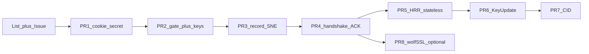

# Upstream DTLS 1.3: experimental opt-in + stacked PRs

Status: planning (fork-only doc — not for upstream v1).

Contribute DTLS 1.3 to Mbed-TLS/mbedtls as an experimental, opt-in feature via a
stacked PR series—starting with a mailing-list heads-up and the small
cookie-secret API—so upstream can keep it as a try-before-stabilize side path
for a cycle or two.

## Tracking todos

- [ ] Draft + send mailing-list note and open Mbed-TLS/mbedtls tracking issue
- [ ] Carve cookie-secret API slice from upstream/development, test, open upstream PR1
- [ ] Add `MBEDTLS_SSL_PROTO_DTLS1_3` opt-in gate on `dtls13` (prep for PR2)
- [ ] After PR1: open PR2 (experimental gate + dtls13 key schedule / sn_key)
- [ ] After PR2: open PR3 (unified header + SNE + epoch pool record path)

## Reality check

- `dtls13` vs `upstream/development`: ~219 commits, ~86 files, ~+17k LOC excluding `local-docs/`.
- Upstream has said contributions are welcome, but DTLS 1.3 is still **roadmap “Future”** ([mailing list](https://lists.trustedfirmware.org/archives/list/mbed-tls@lists.trustedfirmware.org/thread/IJEJKULIU3KF527G2ZMX3GJIJ5NJV3QM/)). Expect review to treat this as **experimental for 1–2 cycles**, not an instant default feature.
- Today the branch enables DTLS 1.3 whenever `MBEDTLS_SSL_PROTO_DTLS && MBEDTLS_SSL_PROTO_TLS1_3`. That is too aggressive for upstream defaults (TLS 1.3 + DTLS 1.2 users would silently get DTLS 1.3 code paths). **Add an explicit opt-in gate first.**

## Contribution posture (side version for a cycle)

1. **Announce before the code flood**: short note on `mbed-tls@lists.trustedfirmware.org` + a GitHub issue on `Mbed-TLS/mbedtls` describing status (RFC 9147 / rfc9147bis, wolfSSL interop, test matrix), proposing `MBEDTLS_SSL_PROTO_DTLS1_3` **off by default**, and offering a stacked PR series.
2. **Frame every PR** as experimental: Doxygen/`mbedtls_config.h` warnings (“API may change”), changelog under Features/experimental, architecture note modeled on early TLS 1.3 docs.
3. **Do not** dump `local-docs/`, wolfSSL harness, or personal coverage scripts into upstream v1.
4. Keep maintaining `yaronf/mbedtls` `dtls13` as the full working tree; each upstream PR is a **cleaned, rebased slice** from that branch onto `upstream/development`.

## Fork vs upstream sync

Yes — **`yaronf/mbedtls` stays**. Remotes stay as today: `origin` = fork, `upstream` = `Mbed-TLS/mbedtls`.

| Branch | Role |
|--------|------|
| `origin/dtls13` | Long-lived **integration** branch: full DTLS 1.3 + local-docs + wolfSSL tests. Day-to-day work lands here. |
| `upstream/development` | Moving target; never commit DTLS 1.3 directly here. |
| `origin/dtls13/NN-*` (e.g. `dtls13/01-cookie-secret`) | Short-lived **upstream PR** branches: thin, DCO-clean slices based on current `upstream/development`. |

**Absorbing ongoing `upstream/development` changes** (same pattern as the 4.1 / 4.2 merges already done):

1. Periodically on `dtls13`: `git fetch upstream` then **merge** `upstream/development` into `dtls13` (prefer merge over rebase for this long-lived branch — preserves history and matches prior “Merge: mbedtls X.Y into dtls13” style). Resolve conflicts, rebuild, run unit + `dtls13-tests` (+ wolfSSL if touching interop).
2. After that merge, **refresh open PR branches**: rebase each `dtls13/NN-*` onto the new `upstream/development` tip (or recreate the slice). Force-push only those short-lived PR branches after rebase.
3. When an upstream PR **merges**, the next `dtls13 ← upstream/development` merge brings that code in “for free.” If `dtls13` still has a divergent form of the same feature, resolve by taking upstream’s merged version and re-applying only remaining fork-only deltas (tests/docs/gate tweaks).
4. Review fixes made on a PR branch should be **cherry-picked or merged back into `dtls13`** so the fork does not drift from what upstream accepted.
5. Cadence: merge upstream into `dtls13` at least around mbedtls releases / large SSL churn; more often if open PRs are actively under review.

Do **not** rebase the whole `dtls13` history onto upstream for routine sync — that fights the 200+ commit integration branch. Rebase is for the small contribution slices only.

## Config gate (required in PR2, before record-layer PR3)

Add **`MBEDTLS_SSL_PROTO_DTLS1_3`** in `include/mbedtls/mbedtls_config.h`:

- Default: commented out / off.
- Requires: `MBEDTLS_SSL_PROTO_DTLS` + `MBEDTLS_SSL_PROTO_TLS1_3`.
- Enforce in `library/mbedtls_check_config.h`.
- Replace `#if defined(MBEDTLS_SSL_PROTO_DTLS) && defined(MBEDTLS_SSL_PROTO_TLS1_3)` DTLS-1.3 bodies with this macro.
- Runtime: do not negotiate/advertise DTLS 1.3 unless the macro is enabled.

CID stays under existing `MBEDTLS_SSL_DTLS_CONNECTION_ID`. Cookie-secret API stays under `MBEDTLS_SSL_PROTO_DTLS` (useful for 1.2 opt-in too).

## Stacked PR series (dependency order)

LOC figures are **approximate net additions** (library + public headers + tests + programs) vs `upstream/development`, excluding `local-docs/`. Shared files (`ssl_msg.c`, `ssl.h`, harness) are attributed by theme; expect ±25% after clean cherry-picks.

Former monolithic “gate + record” PR (~4–5k) is split into **PR2 + PR3** so crypto/config review stays separate from the record-layer diff.

| PR | Title | Scope | Expected size | Key paths |
|----|--------|--------|---------------|-----------|
| **1** | DTLS cookie-secret API | `mbedtls_ssl_conf_dtls_cookie_secret()` + helpers; DTLS 1.2 HVR only behind explicit apply-to-1.2 flag (no silent 1.2 change) | **~0.9–1.2k LOC** (`ssl_cookie_secret.c` alone is +406) | `library/ssl_cookie_secret.c`, `include/mbedtls/ssl.h`, `library/ssl_tls12_server.c`, focused unit tests |
| **2** | DTLS 1.3 experimental gate + key schedule | Opt-in `PROTO_DTLS1_3`; `"dtls13"` HKDF label prefix; `sn_key` / traffic-secret helpers; epoch-slot typedefs in headers; architecture note. No full record I/O yet (stubs/guards OK). | **~1.5–2.0k LOC** | config/check_config, `library/ssl_tls13_keys.c`/`.h`, epoch types in `include/mbedtls/ssl.h` / `library/ssl_misc.h`, key-schedule unit tests, short `docs/architecture/` note |
| **3** | DTLS 1.3 record layer (unified header + SNE) | Unified header parse/write, SNE, AAD, epoch pool wiring into protect/deprotect; SNE test vectors. Still no full handshake/ACK. | **~2.5–3.5k LOC** (bulk of `ssl_msg.c` record path) | `library/ssl_msg.c`, `tests/suites/test_suite_ssl.dtls13.data` (+ matching `.function` cases) |
| **4** | Handshake + ACK | 1-RTT / PSK / NST / ACK flights / retransmit; minimal `tests/dtls13` mbedtls harness + handshake/psk/proxy-basic | **~5–6k LOC** (handshake sources + ACK + new yaml harness) | `ssl_tls13_{client,server,generic}.c`, ACK pieces of `ssl_msg.c`, `ssl_client2`/`ssl_server2` flags needed for tests |
| **5** | HRR cookie + stateless | Wire secret into RFC 9147 §5.1; cluster/stateless test | **~0.7–1.0k LOC** | `ssl_tls13_server.c`, `tests/dtls13/cluster-test.sh`, hrr-cookie cases |
| **6** | KeyUpdate + post-HS retransmit | KU ACK/epochs, AEAD/auth-fail limits, post-HS slots | **~1.5–2.0k LOC** | APIs in `ssl.h`, keyupdate cases |
| **7** | CID | C-bit CID, NCI/RCI, pools, rotate | **~1.4–1.8k LOC** | CID cases; behind `MBEDTLS_SSL_DTLS_CONNECTION_ID` |
| **8** (defer) | wolfSSL interop | Dir A/B runners; optional `library/net_sockets.c` ECONNREFUSED retry | **~0.9–1.1k LOC** | only after core is reviewable |

Sum of midpoints ≈ **16–17k LOC**, consistent with the non-`local-docs` branch delta. Largest remaining review chunk is **PR4** (~5–6k); PR2/PR3 stay in the ~2–3.5k band.

**First code PR to open: PR1.** Then **PR2** (gate + keys) so defaults stay honest, then **PR3** (records).

## Explicitly leave out of upstream v1

- Entire `local-docs/` (plans, RFCs, ultrareview, interop notes — including this file)
- `tests/run-3d-sweep.sh`, `tests/run-hrr3d.sh`, coverage-in-podman helpers
- wolfSSL tree until PR8
- `.DS_Store` / build-dir gitignore noise

## Process per PR (mbedtls CONTRIBUTING)

- Base: `upstream/development`; branch naming like `dtls13/01-cookie-secret`
- DCO sign-off on every commit; prefer a **small number of clean commits** per PR (squash/cherry-pick from `dtls13`, don’t replay 219 commit messages)
- Changelog entry; tests in the same PR; coding standards / githooks
- PR body: experimental status, how to enable, test commands, link to tracking issue
- Expect iteration; do not assume LTS backport

## Immediate next actions (after you approve this plan)

1. Draft mailing-list + GitHub issue text (experimental framing, stack outline, ask maintainers if they prefer a long-lived `dtls13` branch on the official repo vs stacked PRs into `development`).
2. Carve PR1 onto a fresh branch from `upstream/development` (cookie-secret only + tests), run relevant unit tests, open upstream PR.
3. In parallel on `dtls13`, land the `MBEDTLS_SSL_PROTO_DTLS1_3` gate so PR2 is honest about defaults.
4. After PR1/PR2 feedback: open PR3 (record/SNE) as the next stack item.
